# TriviaFoundry

**Writes your pub quiz or trivia night, then runs it live.** Describe the rounds
you want and get a complete pack, a presenter script and printed PDF
question/answer sheets — then run the night live with teams submitting answers
from their phones.

**Live**: https://triviafoundry.com (the original
`pub-quiz-trivia-night-automation-hu.vercel.app` host stays as an alias).

Repo name predates the product name: the app was "Pub Quiz Hub" until
2026-09-16, when it became TriviaFoundry (pubquizhub.app turned out to be a
live competitor). The GitHub slug was left alone so existing links and
Vercel wiring keep working.

## Screenshots

Real, in-browser captures from `npm run screenshots` (Playwright drives an
actual live session end-to-end — nothing here is mocked or hand-edited).

| | |
|---|---|
| 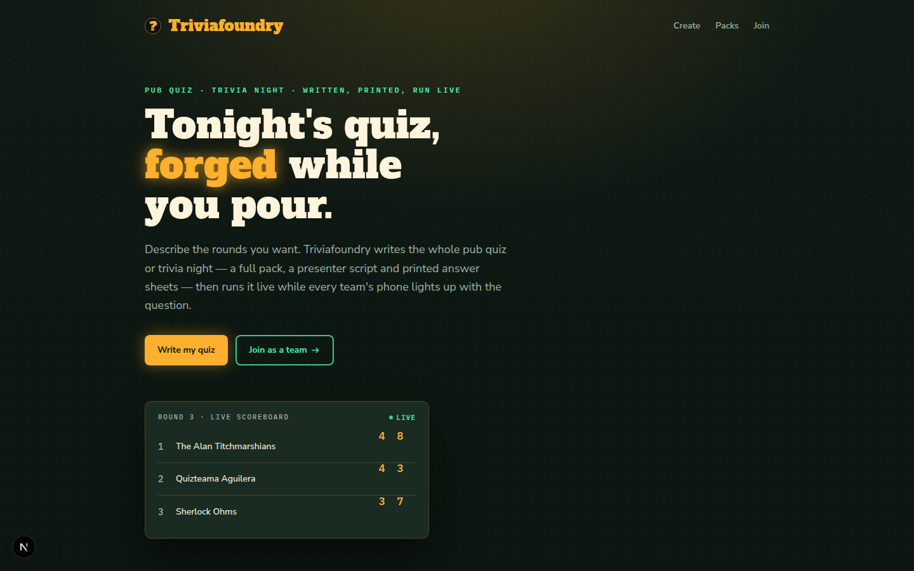 Landing page | 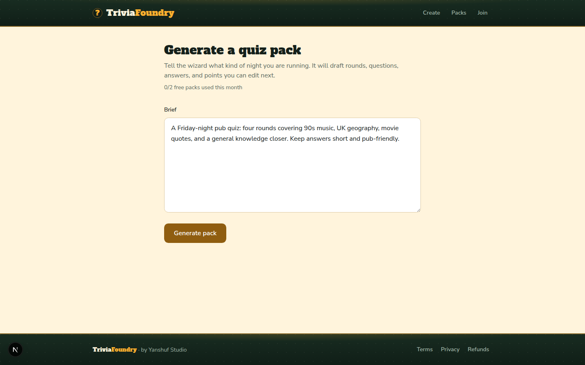 AI generation wizard |
| 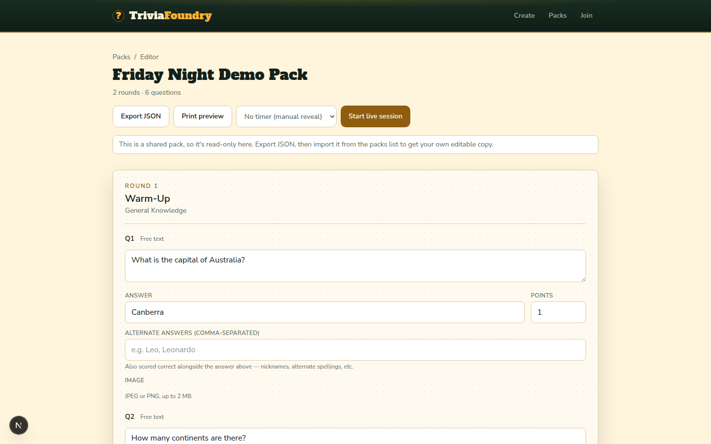 Pack editor | 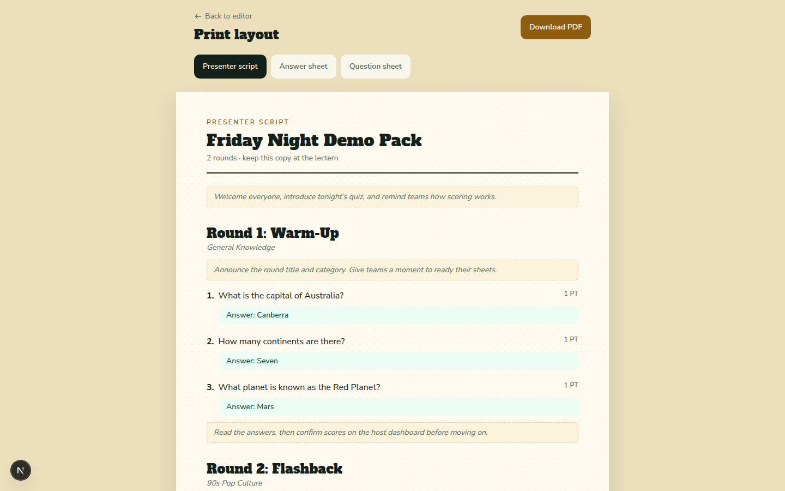 Presenter script / print preview |
| 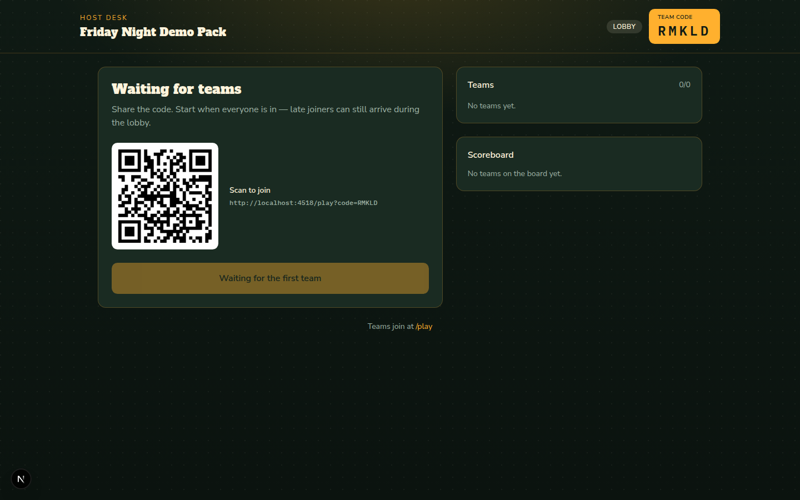 Host desk — lobby, with a scannable join link | 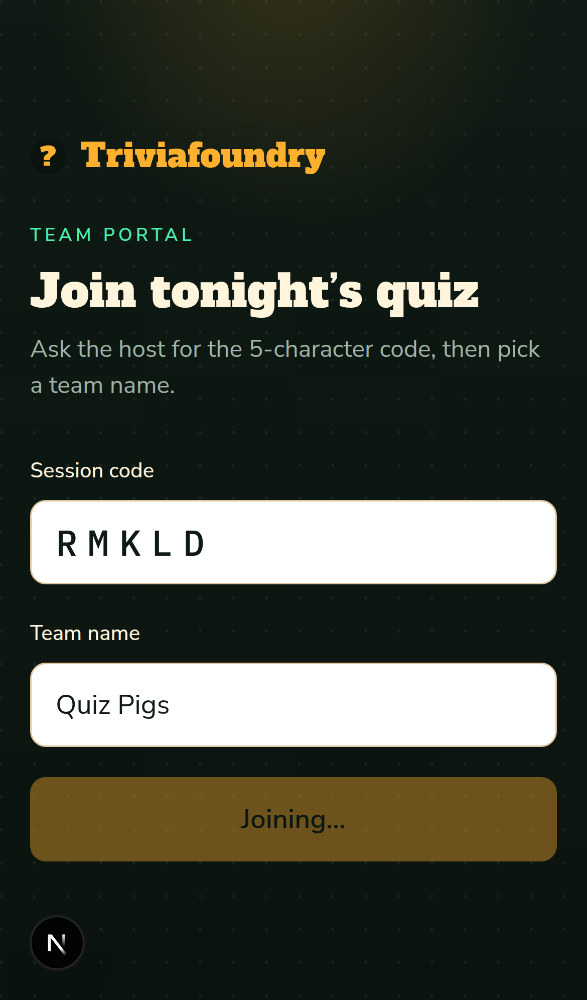 Team portal — join screen |
| 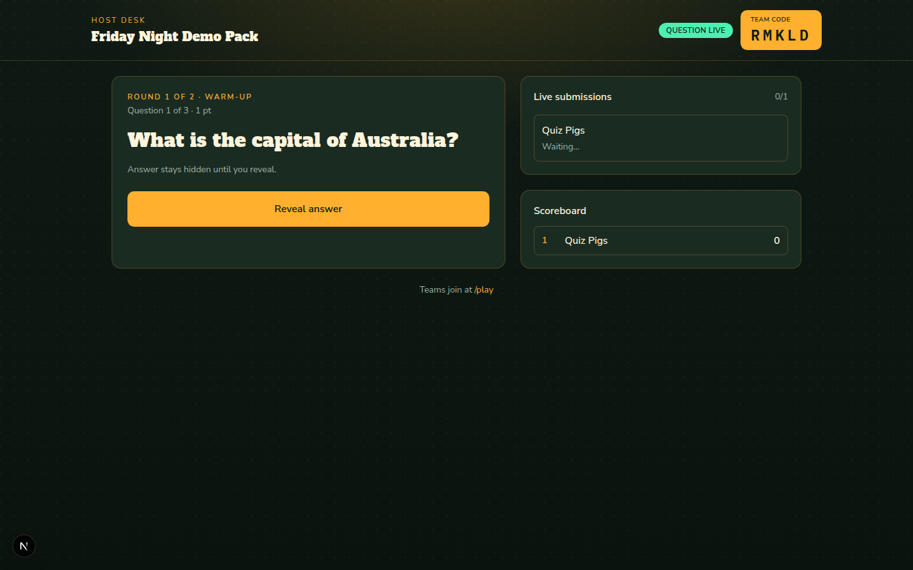 Host desk — question live | 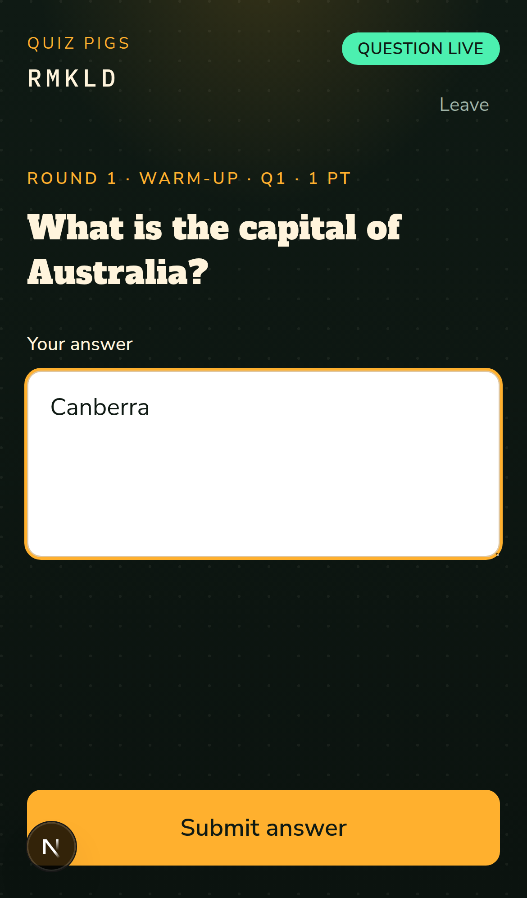 Team portal — answering |
| 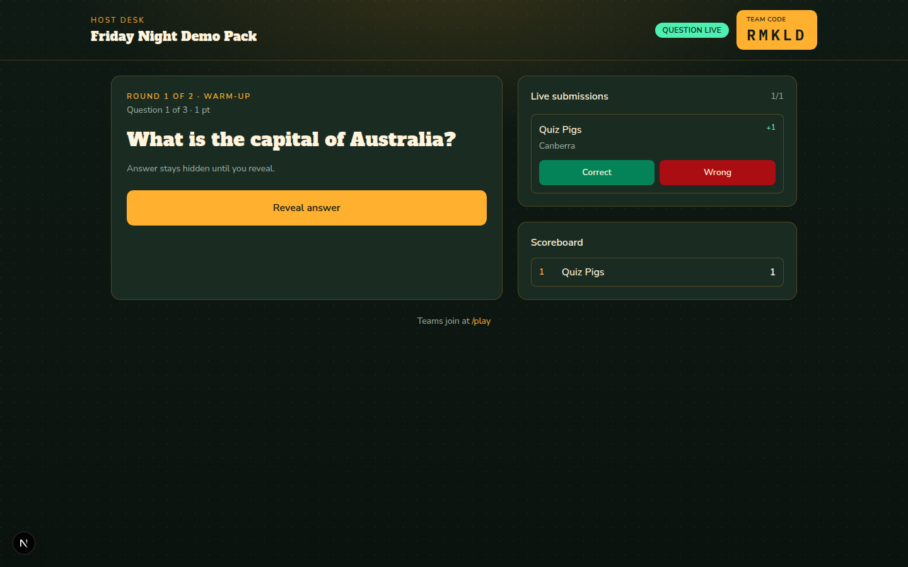 Host desk — live submission, auto-scored | 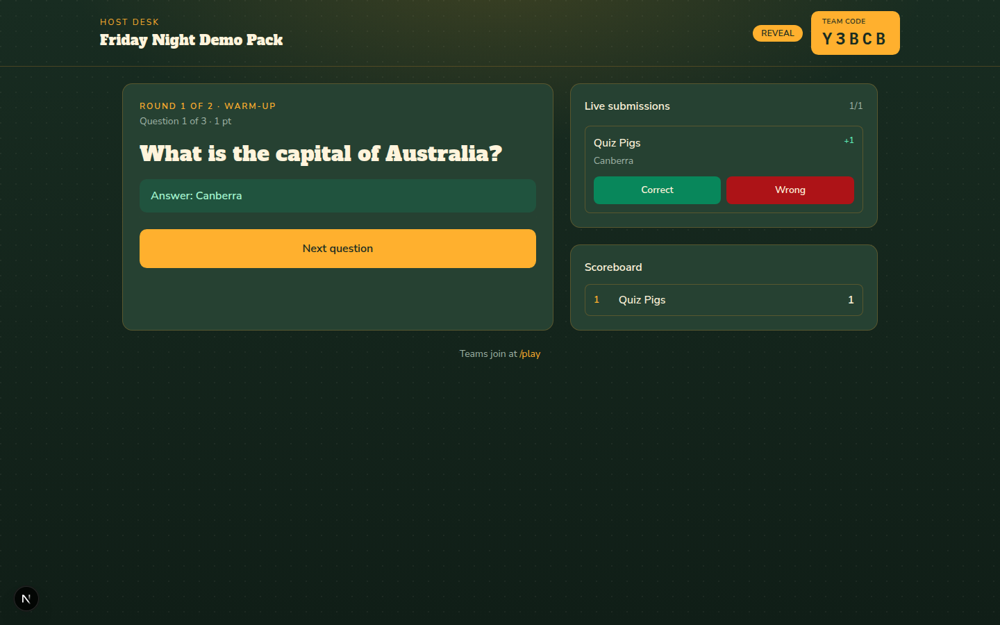 Host desk — revealed, scoreboard updated |
| 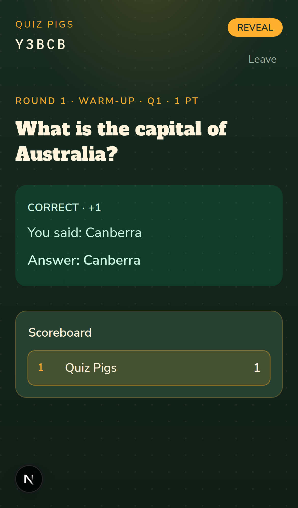 Team portal — reveal, correct + score | |

Regenerate these anytime with `npm run screenshots` (spins up its own
throwaway DB and dev server, so it never touches `prisma/dev.db`).

## Stack

- Next.js (TypeScript, App Router, Tailwind)
- Prisma + SQLite/libSQL (local file for dev, Turso for a real deploy — same
  code either way, see Deployment below)
- Anthropic (Claude) API for quiz generation (structured tool-use output)
- `@react-pdf/renderer` for PDF export
- Vitest for unit tests
- Live team portal via polling (no websockets)
- Installable as a PWA (`src/app/manifest.ts` + the icon set in `public/`);
  no service worker on purpose, since the live session is polling and an
  offline shell would only look alive

## Setup

```bash
npm install
cp .env.example .env   # then fill in ANTHROPIC_API_KEY
npx prisma migrate dev
npm run dev
```

Open [http://localhost:3000](http://localhost:3000).

## Deployment

The default `.env` setup (a local SQLite file, an in-memory rate limiter) is
right for local dev or a single long-running process, but not for a
serverless host — an ephemeral/read-only filesystem has nowhere to write a
SQLite file, and each invocation can be a fresh cold instance with its own
memory, so neither survives past one request. Both pieces are swappable
purely through environment variables — no code changes:

- **Database**: Prisma connects via a libSQL driver adapter
  (`prisma.config.ts` for the CLI, `src/lib/db.ts` for the app itself), which
  speaks the same protocol against a local file or a real hosted database.
  Create one with [Turso](https://turso.tech) (`turso db create <name>`),
  then set `DATABASE_URL` to its `libsql://...` URL and `DATABASE_AUTH_TOKEN`
  to a token from `turso db tokens create <name>`. Run
  `npx prisma migrate deploy` once against that URL before first traffic.
- **Rate limiting**: set `UPSTASH_REDIS_REST_URL` and
  `UPSTASH_REDIS_REST_TOKEN` (from a free database at
  [Upstash](https://console.upstash.com)) and `src/lib/rate-limit.ts`
  automatically switches from its in-memory fallback to a real shared store,
  so the limit is enforced across every instance instead of resetting per
  cold start.

Leaving either pair of env vars unset keeps today's local-dev behavior
(a `prisma/dev.db` file, an in-process limiter) — both are additive, not a
breaking config change.

- **Function timeout**: a four-round generation takes 20–30s end to end,
  well past the 10s default a serverless host gives a function.
  `src/app/api/packs/generate/route.ts` exports `maxDuration = 60` for that
  reason; if your host caps functions lower than that (or you raise the
  default pack size), the request dies as a gateway 504 before the pack is
  saved. The `/create` page shows that as a plain "server returned status
  504" message rather than a JSON-parse error.

No API key yet? `POST /api/packs/seed` creates a small static demo pack so you
can exercise the editor, PDF export, and live session flow without calling
Claude. There's also a CLI seed script: `npm run db:seed`.

## Core flow

1. **Generate** — `/create` sends a free-text brief to
   `POST /api/packs/generate`, which calls Claude (via a forced tool call, so
   the response is schema-validated JSON) and persists the pack via Prisma.
   Validation degrades rather than rejects where the fix is obvious: a
   multiple-choice question with an unusable option set becomes free-text,
   and a missing pack title is derived from the round titles
   (`src/lib/quiz-schema.ts`) — both were observed in real model output and
   each used to throw away an otherwise good 40-question pack. When strict
   parsing still fails, `salvageGeneratedPack` keeps every question that
   stands on its own and drops only what doesn't, so a response truncated at
   `max_tokens` yields the 33 questions that arrived intact instead of a 502.
   Failures that remain are told apart rather than collapsed into one status:
   **422** when the brief asked for a bigger pack than one generation holds
   (retrying can't help — the message says what to change), **503** when the
   model API is rate-limiting or down, **502** for anything else.
2. **Edit** — `/packs/[id]` lists rounds/questions for inline editing
   (`PATCH /api/questions/[id]`), optionally with an image per question
   (`POST`/`GET`/`DELETE /api/questions/[id]/media` — see Security notes),
   and links to PDF exports
   (`GET /api/packs/[id]/pdf?type=questions|answers|script`). A pack can
   also be exported as a portable JSON file (`GET /api/packs/[id]/export`,
   format `pub-quiz-pack` v1, ids stripped, host-approved alternate answers
   kept) and re-imported from the packs list (`POST /api/packs/import`) —
   on the same deployment or a different one — without spending an AI call.
3. **Host** — `POST /api/sessions` creates a live session with a short join
   code **and a separate, unguessable host key** (returned once, stored in
   the host's browser). The host dashboard polls
   `GET /api/sessions/[code]?as=host&hostToken=...` and drives the state
   machine via `POST /api/sessions/[code]/advance` (`start` → `reveal` →
   `next`), both requiring that key.
4. **Play** — Teams join with `POST /api/sessions/[code]/join` (returns a
   token), then poll `GET /api/sessions/[code]?token=...` and submit answers
   via `POST /api/sessions/[code]/answers`. Answers are auto-scored by
   normalized exact match; the host can override via
   `PATCH /api/sessions/[code]/answers/[answerId]` (also host-key gated).

Session states: `LOBBY → QUESTION_ACTIVE → REVEAL → (next question or ENDED)`.
Every state transition is an atomic conditional update (`updateMany` guarded
by the exact state it read), so two concurrent advance calls — a double-tap,
a retried request on flaky venue wifi — can't both apply; the loser gets a
409 instead of silently skipping a question.

## Security notes

- **Join code vs. host key**: the join code is handed to every team by
  design, so it can't double as proof of host authority. Session creation
  also returns a separate host key, required on every session-control
  endpoint (`advance`, the answer-score override, and the host view) and
  compared with a constant-time check (`src/lib/host-auth.ts`). The host
  dashboard stores it in `localStorage`; if that's lost (different device,
  cleared storage), `/host/[code]` offers a "paste your host key" recovery
  form rather than a hard lockout.
- **Rate limiting**: every unauthenticated write is bounded. `POST
  /api/packs/generate` (spends real Anthropic API credit),
  `POST /api/packs/seed`, `POST /api/packs/import`, `POST /api/sessions`
  (writes a row and consumes one of a finite pool of 5-character join codes)
  and `POST /api/sessions/[code]/join` are throttled per-IP
  (`src/lib/rate-limit.ts`) — backed by Upstash Redis when
  `UPSTASH_REDIS_REST_URL`/`UPSTASH_REDIS_REST_TOKEN` are set (see
  Deployment above), or an in-memory, single-instance Map otherwise, which
  is fine for local dev but not a real multi-instance deployment target. It
  keys on `x-forwarded-for`/`x-real-ip`, which a direct caller can set to
  anything — this assumes a trusted reverse proxy in front (e.g. Vercel's
  edge network) that sets those headers itself and doesn't pass through a
  client-supplied value. If this is ever exposed with no such proxy in
  front, the limiter
  offers no real protection; that's a deployment-topology assumption worth
  confirming before going further than this app's current single-operator
  scale.
- **Team cap per session**: the join code is printed on the table QR and
  read out to the room, so joining cannot be authenticated — anyone holding
  the code may join, by design. It is bounded instead: a session accepts at
  most 60 teams (`src/app/api/sessions/[code]/join/route.ts`), well above a
  real venue's 5-25, so one person with the code can't fill a host's
  scoreboard with junk teams mid-quiz. The cap is per session, so it holds
  against a caller rotating IPs past the rate limiter.
- **Host accounts** (`src/lib/auth.ts`, `src/lib/auth-guard.ts`): hosts sign
  in with Google or an emailed code — no passwords. Accounts live in this
  app's own Turso database (Better Auth with the Prisma adapter), and a
  `Creator` belongs to one.
  **The email carries one secret two ways**: six digits to type, and a link
  to `/sign-in/confirm` carrying the same digits. Nothing consumes on a GET
  — the link opens a page with a button, and only that button's POST spends
  the code. That is not a nicety: corporate mail filters (Microsoft 365 Safe
  Links and friends) fetch every link in incoming mail before the person
  clicks, so a link that signs you in on GET is a link the filter has
  already used up. The typed code is the other half of the same answer, and
  covers the host who reads mail on a phone and runs the quiz on a pub PC.
  One secret means one 15-minute expiry, one five-guess budget and one
  single use. Every host-side page and API checks
  `auth.api.getSession` for itself: pages redirect to
  `/sign-in?next=<path>`, APIs answer 401 JSON. `src/proxy.ts` (Next 16's
  renamed `middleware.ts`) also redirects on a missing session cookie, but
  that is an optimistic check and explicitly not the defence — it cannot
  tell a valid cookie from a forged one.
  **Teams never sign in** — a pub full of strangers cannot be asked to make
  an account to answer question three. `/play`, joining, answering, the team
  portal, `GET /api/sessions/[code]` and `GET /api/questions/[id]/media` take
  no account. They are not uncredentialled, though: joining is the only one
  that takes nothing, because joining is how a team gets its token, and every
  other one takes that token. Public: `/`, `/pricing`, `/terms`, `/privacy`,
  `/refunds`, `/sign-in`.
- **Pack ownership** (`src/lib/pack-access.ts`): a pack belongs to the
  `Creator` behind a signed-in account. `/packs` and `GET /api/packs` list
  shared packs (no owner — the seeded demo pack) plus the host's own; every
  edit route (`POST /api/questions`, `PATCH`/`DELETE /api/questions/[id]`,
  `DELETE /api/rounds/[id]`, `POST /api/rounds/[id]/move`) answers 401
  without a session and 403 when the session's creator is not the pack's.
  Shared packs are read-only for everyone; Export JSON then Import gives a
  host their own editable copy. **Reading a pack is owner-only too** — the
  editor, the print sheet, the PDFs, `GET /api/packs/[id]/export`, `GET
  /api/packs/[id]` and starting a session on it all answer somebody else's
  pack exactly as they answer a pack that does not exist, so an id cannot be
  probed. The ownerless demo stays readable by any signed-in host.
  `GET /api/questions/[id]/media` followed (`src/lib/question-media-access.ts`):
  a question id is not a credential either. It serves a team holding a token
  for the session whose **current** question it is — the same credential, for
  the same question, that the session payload already answers with
  `hasMedia: true` — or the desk holding that session's host key, or a host
  who may read the pack. Everyone else gets the 404 a question with no image
  gets. **No read by id is open any more.**
- **Claiming a pre-accounts cookie** (`src/lib/creator-claim.ts`): the
  `pq_creator` cookie is no longer identity and nothing sets it any more. It
  survives for exactly one purpose: a browser that still carries one can hand
  it over once, on sign-in, so the packs and used allowance behind it move
  onto the account. A `Creator` that already belongs to another user is never
  taken, and a merge keeps the **higher** of the two used counts — otherwise
  claiming would itself be the way to refund an allowance.
- **Question images are stored, never linked** (`src/lib/media.ts`): a
  question may carry one image, uploaded by the pack's owner to
  `POST /api/questions/[id]/media` and served back from the same path. The
  bytes are stored in the database and no surface ever renders an image from
  a URL. That is a security property, not a storage preference:
  `@react-pdf/renderer` resolves `<Image src>` server-side during render
  with a bare `fetch` — no scheme restriction, host allowlist, timeout or
  size limit, redirects followed — and `GET /api/packs/[id]/pdf` is
  deliberately unauthenticated, so a question image held as a URL would let
  any visitor make the server fetch an address of their choosing and read
  the result out of the returned PDF. The PDF path is handed `data:` URIs,
  which are decoded in-process. `src/test/pdf-media-offline.integration.test.ts`
  renders with `fetch` stubbed and fails if a render reaches the network.
  Uploads are validated on their bytes, never on the request's
  `Content-Type` or a filename: JPEG and PNG only (SVG is refused — it can
  reference external resources and is a parser attack surface), 2 MB and
  4096x4096 maximum, with the dimensions read from the header so nothing
  ever decodes a decompression bomb. Upload and delete are owner-gated and
  rate-limited; `GET` is open, like every other read by id here.
- **`ADMIN_TOKEN`** (optional, see `.env.example`): an operator override for
  `DELETE /api/packs/[id]`, supplied via an `x-admin-token` header. Without
  it, that route accepts only the pack's own creator cookie. The gate fails
  **closed**: with no `ADMIN_TOKEN` configured there is no operator, so no
  request is treated as one and ownership alone decides
  (`src/lib/admin-auth.ts`). A deployment that forgets to set the variable
  therefore loses the override, not the protection. Nothing in the UI calls
  this route today; it exists to be reachable safely once something does.
- **`FREE_DAILY_PACK_CEILING` / `PRO_DAILY_PACK_CEILING`** (optional,
  defaults 20 and 50, see `.env.example`): hard ceilings on how many packs
  the **whole deployment** generates per UTC day, enforced before the model
  is called. These, not `FREE_PACK_LIMIT`, are what bound the Anthropic bill.
  The per-account cap is spent by generating; it used to be counted against
  the `pq_creator` cookie, so deleting the cookie reset it and never sending
  one skipped it entirely. Accounts closed that door, but signing up is free,
  so an attacker can still rotate accounts — and these ceilings have no
  identity in the key at all, which is why they, and not `FREE_PACK_LIMIT`,
  are what actually bounds the bill. Free and Pro count in separate
  buckets, so free traffic cannot exhaust a subscriber's capacity; Pro has no
  per-user cap and its ceiling is purely a runaway-loop backstop. They are
  read per request, so a change needs no rebuild, and they are only genuinely
  global when Upstash is configured — without it each serverless instance
  counts separately (`src/lib/daily-ceiling.ts`).
- These are proportionate to this app's actual trust model — one host
  running one venue's quiz for a room of teams — not a multi-tenant SaaS
  auth system. See [PROMPTS.md](./PROMPTS.md) history / commit messages for
  the fuller threat-model reasoning.

## Testing

```bash
npm run test              # unit tests (scoring, scoreboard, session state machine)
npm run test:integration  # full session-lifecycle tests against a real (throwaway) SQLite DB
npm run test:e2e          # Playwright: real browser, host + team tabs, full UI flow
npx tsc --noEmit          # typecheck
npm run lint
```

`test:integration` spins up `prisma/test.db` (migrated fresh each run, gitignored)
and drives the actual route handlers — create pack → create session → join →
answer → auto-score → reveal → host override → advance through every question
to `ENDED` — plus edge cases like duplicate team names, answering before the
quiz has started, a second answer after the host has revealed, joining
mid-game vs. joining a session that's already ended, and the wizard's
input-validation and unconfigured-API-key paths (`src/test/edge-cases.integration.test.ts`).

Unit tests also cover input-boundary regressions directly — e.g. a
whitespace-only prompt or team name passing a naive `.min(1)` check
(`quiz-schema.test.ts`) and the rate limiter's window/isolation behavior
(`rate-limit.test.ts`).

`test:e2e` runs against `prisma/e2e.db` (own throwaway DB, migrated fresh
by a Playwright global setup) and a dedicated `next dev` on port 4517 that
Playwright starts itself. It drives two real browser contexts (host + team)
through the actual UI: seed a pack via API, open the pack editor, click
"Start live session", join as a team on `/play`, submit an answer, reveal,
and assert the scoreboard updates on both sides.

### Load test

```bash
npm run build && PORT=4933 npm run start        # production build, in one terminal
npm run load-test -- --teams=20 --base=http://localhost:4933   # in another
```

Simulates N teams joining a fresh session and polling every ~3s (like real
phones) while a host driver advances the quiz to completion, printing
latency stats for polls, answer submissions, and host advance calls. Run
against a **production build** (`next start`, not `next dev`) — dev mode's
Turbopack JIT-compiles each route on first hit, so its numbers swing wildly
with cache state and aren't a meaningful baseline either way.

A 20-team run against a production build, after host-key auth and
per-IP rate limiting landed in the request path, completed in ~26s with
p95 poll latency ~118ms and p95 join latency ~496ms — comfortably fine at
this app's target scale. (An earlier dev-mode run had cited p95 poll
latency around 2s; that number was never a fair baseline and shouldn't be
compared against this one — different mode, different warm/cold cache
state, not a real before/after.)

`409 This question is no longer accepting answers` errors are expected — a
team's submit racing the host's reveal — and the UI already surfaces them
as a normal inline error rather than crashing. The *count* of these errors
scales with how fast the server responds relative to the load-test
script's fixed timing constants (`THINK_TIME_MS`, `REVEAL_PAUSE_MS`): a
faster server finishes the simulated night faster, so a fixed-duration
"think time" eats a bigger share of a shorter game, and more teams get
caught mid-answer at reveal. That's an artifact of the simulator's pacing,
not a real-world degradation — real hosts don't reveal on a clock keyed to
server response time.

## CI

`.github/workflows/ci.yml` runs typecheck, lint, unit tests, integration
tests, and the Playwright E2E test on every push/PR — no secrets required
(nothing in the suite calls the real Claude API).

## Legal pages

`/terms`, `/privacy` and `/refunds` are public server-rendered pages, linked
from a site-wide footer that the root layout renders on every page except the
two live-night surfaces (`/play`, `/host/<code>`) and the print sheet
(`/packs/<id>/print`), which deliberately carry no chrome. They exist because
Paddle's website review — the gate on going live with real payments — requires
the production domain to serve terms, a privacy policy and a refund policy, and
to have them reachable from the site rather than merely present at their URLs.
That is what `e2e/legal-pages.spec.ts` checks: each page answers 200 with its
own heading, the footer links reach all three, and the excluded surfaces still
have no footer.

The content is specific to this app rather than a generic template: the free
tier's two-packs-per-30-days limit, Pro at $5/month or $25/year, Paddle as
merchant of record, and the actual list of what the app stores (the
`pq_creator` cookie, quiz content, live team names and answers, uploaded
question images) and who processes it (Paddle, Vercel, Turso, Anthropic,
Google and Resend). Revising any of them means bumping `LEGAL_LAST_UPDATED`
in `src/lib/site.ts`, which is the single date all three render and the one
`sitemap.ts` publishes.

Wording on these three pages is the owner's, not the codebase's: it is
drafted in the pull request that needs it and committed only once they have
approved it.

The cookie clause on /privacy names every cookie the app can set, which is
three: the sign-in cookie (7 days), a five-minute one set only during a
Google sign-in, and the legacy `pq_creator`, which is no longer set for
anyone. That list was taken from what Better Auth's configured instance
actually emits rather than from its documentation — the session-data and
"don't remember" cookies it can set in other configurations are not reachable
here, because the cookie cache is off and there is no password sign-in to
carry a `rememberMe`.

## Known limitations

- SQLite (or Turso/libSQL — see Deployment) is single-writer; fine at this
  app's target scale (tens of teams, one session at a time) but would need
  to move to Postgres for a multi-tenant deployment (low-effort swap via
  Prisma).
- The `hostToken`/`ADMIN_TOKEN` model assumes one operator per deployment,
  not a distributed multi-tenant service — that's unchanged regardless of
  which database/rate-limiter backend is configured.
- `npm audit` reports 3 high-severity findings, all from the same
  dev-time-only chain (`prisma` CLI → `@prisma/config` → `deepmerge-ts`, a
  stack-exhaustion issue). Not reachable by the running app; no fix is
  available yet without moving to an unstable `prisma@8` release candidate.

## Project docs

See [PROMPTS.md](./PROMPTS.md) for the phase-by-phase build playbook,
including which tasks are better suited to Claude Code vs. Cursor.
